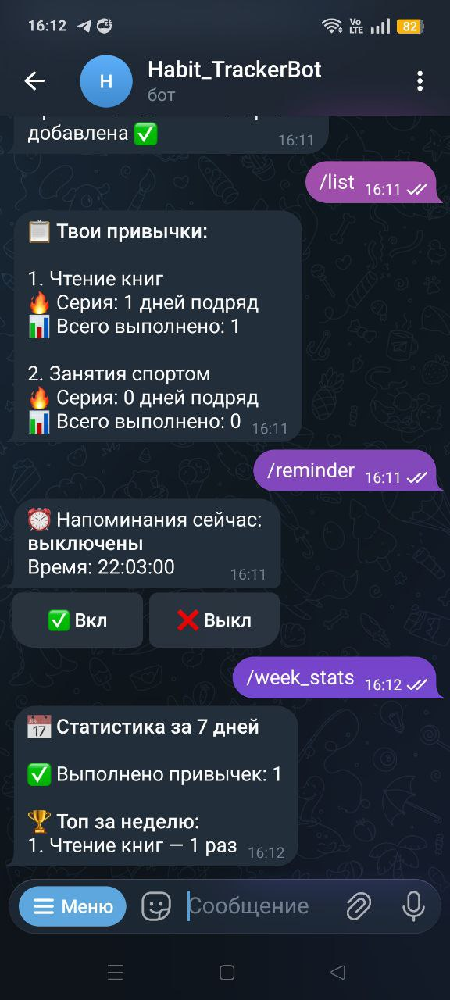
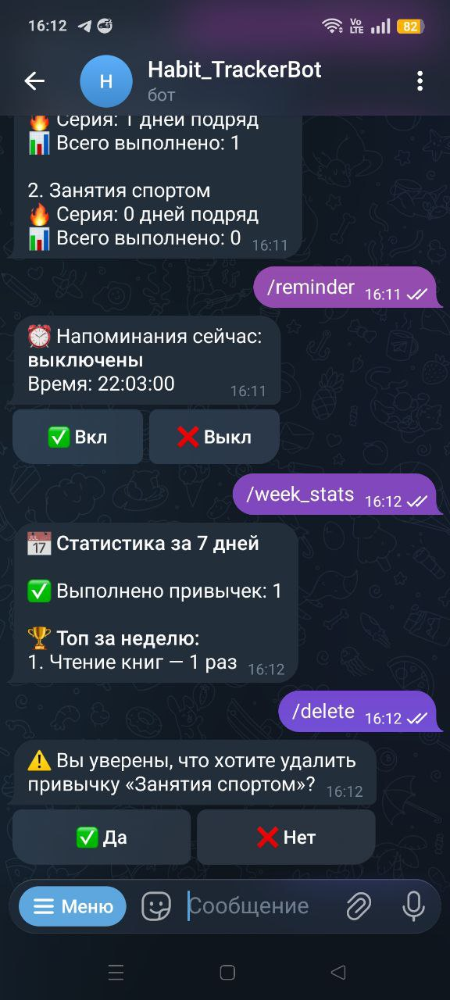

# Habit Tracker Telegram Bot

## 📌 О проекте
**Habit Tracker Bot** — Telegram-бот для отслеживания полезных привычек. Проект разработан на Python с использованием асинхронной библиотеки `aiogram` и `asyncpg` для  реализации асинхронной работой с базой данных PostgreSQL. Бот позволяет пользователям формировать привычки, отмечать выполнение, отслеживать серии (streak - количество серий выполненния привычки в днях), смотреть статистику и получать напоминания.

Проект создавался для портфолио и практики backend-разработки

---

## 🚀 Основные возможности
- ➕ Добавление привычек
- 📋 Просмотр списка привычек
- ✅ Отметка выполненных привычек
- 🔥 Подсчёт серии выполнений (streak)
- 📊 Статистика и аналитика
- 📅 Статистика за последние 7 дней
- 🗑 Удаление привычек с подтверждением
- ⏰ Гибкие напоминания:
  - выбор времени
  - каждый день / будни / выходные
- 🧠 FSM (Finite State Machine) для диалогов
- 🐘 PostgreSQL (asyncpg)
- 🕒 APScheduler для напоминаний
- 📝 Логирование (RotatingFileHandler)

---

## 🛠 Технологический стек
- **Python 3.10+**
- **aiogram 3.x**
- **PostgreSQL**
- **asyncpg**
- **APScheduler**
- **FSM (aiogram)**

---

## 📂 Структура проекта
```
Habit_TrackerBot/
├── bot.py                 # Запуск бота
├── config.py              # Конфигурация и переменные окружения
├── database.py            # Работа с PostgreSQL
├── logger.py              # Логирование
├── .env                   # Переменные окружения
├── handlers/
│   ├── commands.py        # /start, /help и команды
│   ├── habits.py          # Основная логика привычек
│   ├── scheduler_bot.py   # Планировщик напоминаний
│   ├── keyboards.py       # Inline-клавиатуры
│   └── states.py          # FSM-состояния
├── logs/
│   ├── bot.log            # Файл с логами бота
├── README.md
```

---

## 🔄 Логика работы
1. Пользователь добавляет привычку (`/add`)
2. Отмечает выполнение (`/done`)
3. Бот автоматически:
   - считает количество выполнений
   - обновляет streak
4. Напоминания отправляются планировщиком
5. Все данные хранятся в PostgreSQL

---

## 📸 Скриншоты

<p align="center">
    
    
    
</p>

---

## 🧠 FSM и диалоги
FSM используется для:
- добавления привычек
- удаления привычек
- выбора привычки при выполнении
- настройки напоминаний (время + дни)

Это позволяет строить **чистые диалоги без лишних команд**.

---

## 📊 Пример статистики
```
📊 Статистика по привычкам
Всего привычек: 5
Всего выполнений: 42

🔥 Лучшая серия:
Чтение — 12 дней

🏆 Топ:
1. Чтение — 20
2. Спорт — 15

📈 Средняя серия: 6.4 дней
```

---

## 🧾 Переменные окружения (.env)
```
TOKEN=YOUR_TELEGRAM_BOT_TOKEN
DB_HOST=postgres
DB_PORT=5432
DB_NAME=habittracker_bot
DB_USER=postgres
DB_PASSWORD=postgres
```

---

## 👨‍💻 Автор
**Феликс**

Студент прикладной информатики

**Мой GitHub: https://github.com/FelixV-sigma**

---


